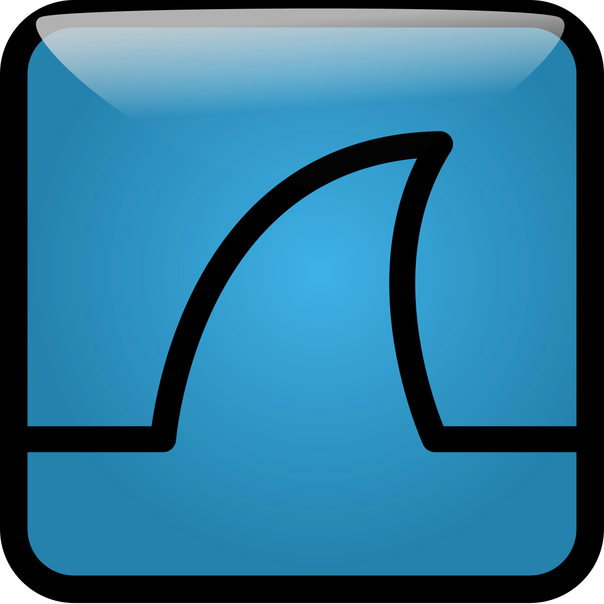
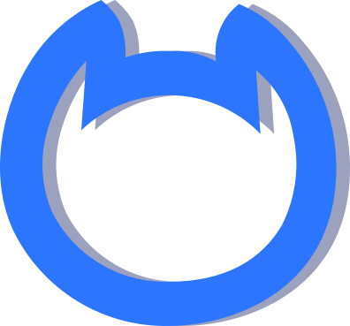

# 👋 Hi! I'm Saurabh Subhash Kokate, a Cybersecurity Enthusiast from India

---

## About Me

I'm passionate about **advanced red teaming**, **zero-day exploit development**, and **AI**. My focus is on creating custom exploitation frameworks and innovative cybersecurity solutions. Currently, I'm diving deep into **AI**, building systems from scratch to assist hackers without relying on existing tools or APIs. In my downtime, I enjoy **solving complex problems**, participating in **CTF challenges**, and pushing the boundaries of cybersecurity.

---
## 🔗 Connect with Me

  
  
  
  

---

## Competitions 🥇

| Competition        | Result        | Team        | Date                |
|--------------------|---------------|-------------|---------------------|
| Pentathon (CTF)    | Participated  | Solo        | 15/03/2024          |
| SIH'24 (IIT Jammu) | Finalist      | Team        | 11-12 December 2024 |

I was a proud finalist in **Smart India Hackathon (SIH'24)** held at **IIT Jammu** from **11th to 12th December 2024**, showcasing innovative problem-solving skills on a national platform.
In addition to participating in the **Pentathon (CTF)**, I’m actively solving challenges on [TryHackMe](https://tryhackme.com) to further hone my cybersecurity skills.

### 👨‍💻 Portfolio  
Check out my personal portfolio website 👉 [saurabhkokate.netlify.app](https://saurabhkokate.netlify.app/)

## Working on: 🚀

- Developing MAK-75, the most advanced keylogger framework with real-time monitoring across all major platforms.
- Learning Go for high-performance backend development.
- Building my own open-source OS.
- Building various scripts and bots, showcasing results here.

## My Projects 🚀

- **MAK-75-Framework**: The most advanced keylogger framework designed to work across multiple platforms (iOS, macOS, Linux, Windows, Android). It allows real-time monitoring of keystrokes without storing them in a database and includes a 0day feature that activates the keylogger without user interaction. [GitHub Repository](https://github.com/kokatesaurabh/MAK-75-Framework)

- **Cyber-Jarvis**: An advanced AI-based system designed to assist hackers by providing real-time support and solutions when they encounter challenges. Built from scratch with a focus on performance and working with large datasets, this tool aims to be a game-changer in cybersecurity. [GitHub Repository](https://github.com/kokatesaurabh/Cyber-Jarvis)

- **BlackHawk-75: Checkmate**: A comprehensive Application Security (AppSec) framework that integrates automated vulnerability detection, exploit generation, and real-time patch recommendations. Designed for both offensive and defensive security teams, BlackHawk-75 offers advanced fuzzing, static/dynamic analysis, and threat modeling to secure web and mobile applications. [GitHub Repository](https://github.com/kokatesaurabh/BlackHawk-75-Checkmate)

- **D3scord**: A Web3-based Discord clone built using blockchain technology. This decentralized platform ensures secure and transparent communication, offering users control over their data and privacy. [GitHub Repository](https://github.com/kokatesaurabh/D3scord)

- **Reverse Shell**: A versatile reverse shell script allowing secure remote access to compromised systems. This tool offers high customizability and is essential for penetration testers and red teamers. [GitHub Repository](https://github.com/kokatesaurabh/reverse-shell)

- **AnonyMac**: A tool designed to enhance network security by automatically changing MAC addresses based on user-defined intervals. This ensures continuous network connectivity while providing an extra layer of anonymity. [GitHub Repository](https://github.com/kokatesaurabh/AnonyMac)

- **TorMap**: A network mapping tool built to operate anonymously over the Tor network. It helps to perform reconnaissance on networks without exposing the tester's identity. [GitHub Repository](https://github.com/kokatesaurabh/TorMap)

- You can explore more of my work on my GitHub portfolio: [kokatesaurabh](https://github.com/kokatesaurabh)

---

Feel free to connect with me and follow my journey in cybersecurity and tech!
## Languages and Tools 

### Languages:

| Python3 | C | JS | Solidity | GO | C++ | Shell Script | Rust |
|----------|----------|----------|-----|-----|------|--------------|------|
|   |   |   |   |   |   |   |   |

  

### Best frameworks and main libraries for Python3:

| Pytorch | Selenium | Numpy | Pandas | Sklearn | OpenCV |
|----------|----------|----------|----------|----------|----------|
|  |  |  |  |  | |

### My tools for Data Manipulation & Visualisation:

| Conda | Jupyter | Spark | MySQL | Postgres | SQLite | Plotly | Matpltlib |
|----------|----------|----------|----------|----------|----------|----------|----------|
||||||| |  |

  
### Environments, Testing, Other:

| nodejs | Git | Docker | Pytest | Swagger | Postman | VBox | HardHat | Kafka |
|----------|----------|----------|----------|----------|----------|----------|----------|----------|
|||||  |  || | |

### OS:

| Ubuntu | Kali | Parrot | BlackArch | Tails OS | Windows XP | Garuda |
|--------|------|--------|-----------|----------|------------|--------|
|  |  |  |  |  |  |  |

### Tools for CTF's
 
| Metasploit | Wireshark | Burpsuite | Netcat | Nmap |
|----------|----------|----------|----------|----------|
||||||

---
Here’s an advanced version of your GitHub stats section with added visual enhancements and interactive elements. 

---
## 🌟 GitHub Stats

  <!-- GitHub Stats -->
  

  <!-- Top Languages -->
  

  <!-- Streak Stats -->
  
  
  <!-- Advanced Contribution Graph -->
  

